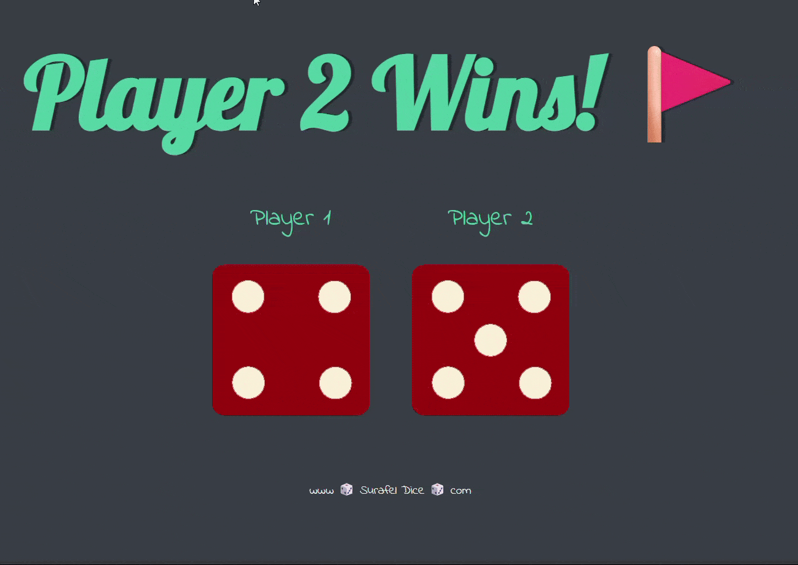

# 🎲 Player 2 Wins! - Dice Game

A fun and interactive two-player dice game built with **HTML, CSS, and JavaScript**. Roll the dice, get lucky, and beat your opponent!

## 🎮 Demo

## 📖 Description

**Player 2 Wins!** is a simple yet engaging dice game where two players take turns rolling dice to accumulate points. The player who reaches the target score first wins the game!

### Features
- 🎲 **Real Dice Rolling** - Realistic dice animations with random outcomes
- 👥 **Two-Player Mode** - Play against a friend or AI opponent
- 🎯 **Score Tracking** - Real-time score display for both players
- 🎨 **Beautiful UI** - Modern, colorful, and responsive design
- ⚡ **Instant Play** - No downloads or installations required
- 📱 **Mobile Friendly** - Works seamlessly on all devices

## 🚀 How to Play

1. **Click the play button** to start the game
2. **Player 1 rolls first** - Watch the dice roll and see your luck!
3. **Player 2 takes their turn** - Same rules apply
4. **First to reach 50 points wins!** - The winner is declared with celebration
5. **Play Again** - Reset and start a new game anytime

## 🛠️ Technologies Used

- **HTML5** - Game structure and layout
- **CSS3** - Animations, styling, and responsive design
- **JavaScript (ES6+)** - Game logic, dice rolling mechanics, and interactivity

## 📦 Installation

1. Clone this repository:
